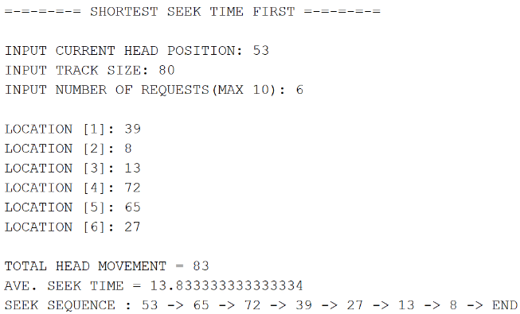

# Disk-and-CPU-Scheduling-Algorithms
This repository is a project I did with my groupmates for our course Operating Systems (ICS26012). The system is designed to be a simulation of a calculator for different CPU Scheduling and Disk Scheduling algorithms. For CPU Scheduling, we implemented two preemptive algorithms, namely: 
*   Shortest Job First (SJF)
*   Priority (P-Prio)
and two non-preemptive algorithms, namely:
*   First Come First Serve (FCFS)
*   Shortest Job First (SJF)
For Disk Scheduling, four algorithms were implemented:
*   First Come First Serve (FCFS)
*   Shortest Seek Time First (SSTF)
*   SCAN
*   LOOK
## Implementation
The project was implemented using the java programming language and coded through the Netbeans 8.2 IDE. 

## Program Flow
*   The program first asks the user which type of scheduling algorithm should the user try. If the user chose CPU scheduling, then they are prompted whether they want to choose preemptive or non-preemptive algorithms. 

*   After choosing, the users will then be prompted regarding the CPU scheduling algorithm that they will use. 

*   If the user chose Disk Scheduling, they will immediately be prompted regarding the Disk scheduling algorithm that they will use. 

## Sample Run
*   CPU Scheduling - Priority (Preemptive)

*   CPU Scheduling - Shortest Job First (Non-preemptive)

*   Disk Scheduling - Scan (left-first)

*   Disk Scheduling - Shortest Seek Time First

